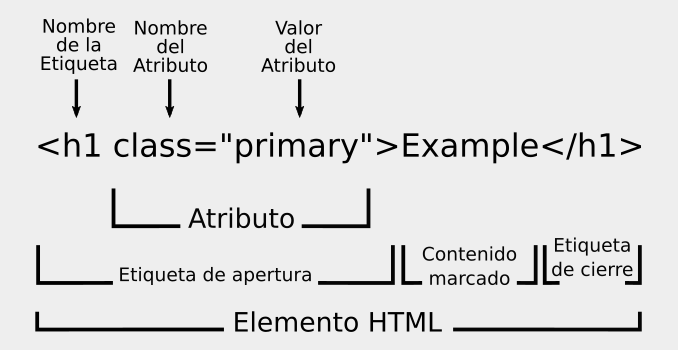
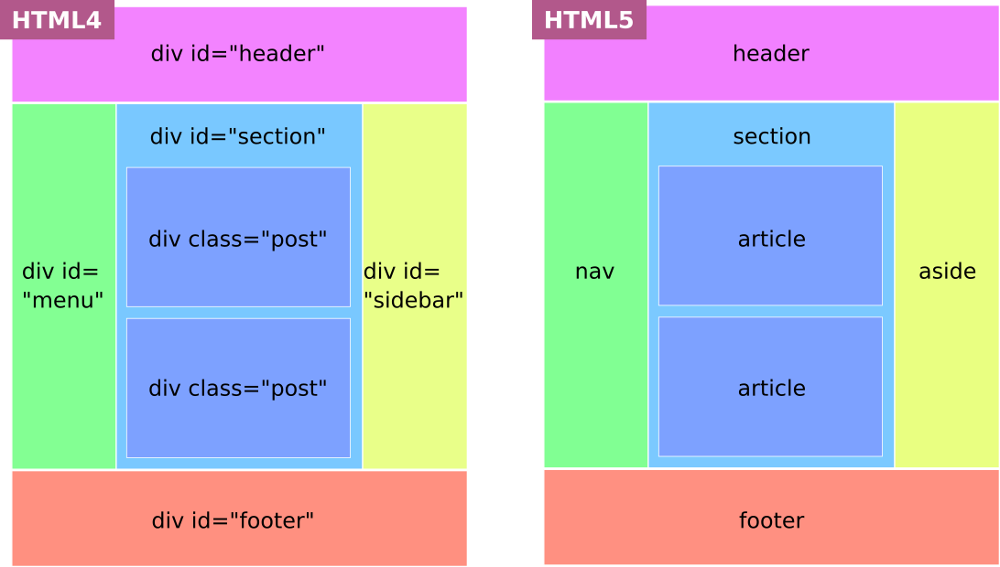
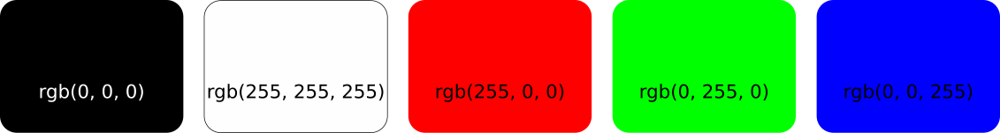
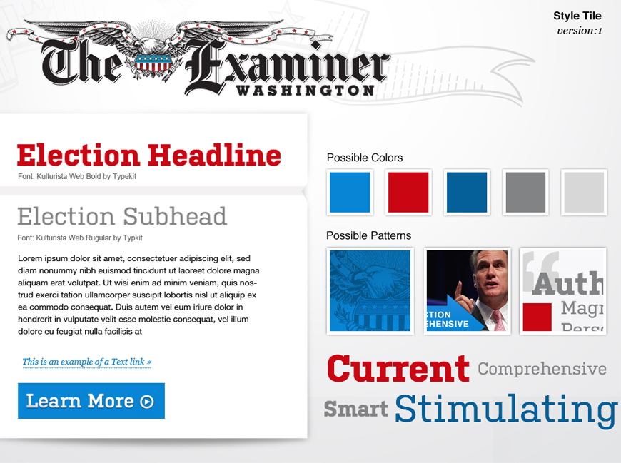

# Taller de introducción a HTML & CSS

###### Busto Bocanegra @ Universidad Nebrija · 2018

---
name: indice

**Indice**

- [HTML](#html)
- [CSS](#css)
- [Extras](#extras)
- [Proyecto final](#proyecto-final)

---
name: html

## HTML

###### Estructura lógica = Contenido

---
name: subindice-html

**Indice**

- [¿Qué es HTML?](#definicion-html)
- [Sintaxis de un elemento HTML](#sintaxis-html)
- [Estructura y semántica de un documento HTML](#semantica-html)
- [Etiquetas HTML fundamentales](#etiquetas-html)
- [Nuevas etiquetas HTML5](#etiquetas-html5)
- [Soporte en navegadores](#soporte-html)
- [Añade un favicon](#favicon)
- [Valida tu código](#validar-html)
- [Ordena tu código](#ordenar-html)
- [Notas sobre accesibilidad](#accesibilidad)
- [Bibliografía y Referencias](#referencias-html)

<br>
[&#8592; Indice principal](#indice)

---
name: definicion-html

### ¿Qué es HTML?

HTML · HyperText Markup Language (lenguaje de marcado de hipertexto).

Es el lenguage de marcado más usado para estructurar y aportar semántica a la información en una página web.

HTML está constituído por una serie de elementos, llamados etiquetas, que envuelven o marcan partes diferentes del documento.

---

#### ¿Qué es HTML5?

Las especificaciones de HTML son desarrolladas por dos organizaciones diferentes:

- 1994 · **W3C · World Wide Web Consortium**
    + [https://www.w3c.es/](https://www.w3c.es/)

- 2004 · **WHATWG · Web Hypertext Application Technology Working Group**
    + [https://whatwg.org/](https://whatwg.org/)

---

**HTML5 es la versión más reciente de la especificación del lenguaje HTML.**

| 2014 | HTML5 · W3C
|:-:|:-|
| 2008 | HTML5 · WHATWG: publicación del primer documento formal
| 2000 | XHTML 1.0 · W3C
| 1991-1999 | HTML versiones 2-4
| 1991 | HTML · publicación del primer documento formal

---
name: sintaxis-html

### Sintaxis de un elemento HTML



- **Etiqueta**: describe las diferentes partes de una página web.
- **Atributo**: provee información adicional sobre el elemento. Está constituído por pares de nombre/valor separado por un igual (=) y con el valor entre comillas ("").
- **Valor**: es una de las opciones permitidas para ese atributo.

---

En lo que respecta a la sintaxis de HTML5, ésta es bastante laxa.

Para el validador de HTML5 las siguientes líneas son idénticas:

```html
<a href=http://example.com class=button button-default>Link</a>
<A HREF="http://example.com" CLASS="button button-default">Link</a>
<A Href="http://example.com" Class="button button-default">Link</a>
<a href="http://example.com" class="button button-default">Link</a>
```

---

**La consistencia es la clave. Elige un estilo de sintaxis y adhiérete a él.**

Considera las siguientes pautas:

- Usa minúscula para todos los elementos y atributos.
- Usa siempre comillas para el/los valor/es de los atributos.
    + `<a href="http://example.com" class="button button-default">Link</a>`
- Omite la barra diagonal en los elementos vacíos.
    + ``

> Nota: se llama **elemento vacío** a aquellos elementos que no tienen etiqueta de cierre y por ello no pueden tener elementos anidados. Ej. `<br>`, `<hr>`, `<input>`, ``, `<meta>`.

---

#### Añadir comentarios al documento HTML

En HTML, al igual que con la mayoría de los lenguajes de programación, podemos añadir comentarios en el código.

Los comentarios son ignorados por el navegador e invisibles para el usuario, pero se pueden ver en el inspector de código.

```html
<!-- Aquí escribo mi comentario -->
```

Algunos usos de los comentarios:

- Indicaciones de uso.
- Notas sobre herramientas de terceros.

---
name: semantica-html

### Estructura y semántica de un documento HTML

---

#### Estructura básica

```html
<!DOCTYPE html>
<html lang="es">
    <head>
        <meta charset="utf-8">
        <title>Título de la página</title>
    </head>
    <body>
        <p>Hello World!</p>
    </body>
</html>
```

---

- El Document Type Declaration o `<!DOCTYPE>` le dice al navegador qué versión de HTML se está usando.

| HTML5 | `<!DOCTYPE html>`
|:-:|:-
| Transitional XHTML 1.0 | `<!DOCTYPE html PUBLIC "-//W3C//DTD XHTML 1.0 Transitional//EN" "http://www.w3.org/TR/xhtml1/DTD/xhtml1-transitional.dtd">`
| Strict XHTML 1.0 | `<!DOCTYPE html PUBLIC "-//W3C//DTD XHTML 1.0 Strict//EN" "http://www.w3.org/TR/xhtml1/DTD/xhtml1-strict.dtd">`
| Loose HTML 4 | `<!DOCTYPE html PUBLIC "-//W3C//DTD HTML 4.01 Transitional//EN" "http://www.w3.org/TR/html4/loose.dtd">` |
| XML Declaration | `<?xml version="1.0" ?>`

---

- El elemento `<html>` representa la raíz de un documento HTML.
    + El atributo `lang` indica el idioma principal para el contenido del elemento. E.j. `es` es el valor para español, `en` para inglés, etc.

---

- El elemento `<head>` contiene metainformación relativa al documento que no será visible al usuario pero sí puede contener información útil para los navegadores y para los buscadores.
    + El elemento `<meta>` con atributo `charset` (de "character set") le indica de forma expresa al navegador la codificación de caracteres utilizada. Es importante que el `charset` se coloque justo después de la apertura de la etiqueta `<head>`, dentro de los primeros 512 caracteres del documento. La codificación más habitual es **UTF-8**.
    + El elemento `<title>` especifíca el título del documento.

---

- El elemento `<body>` alberga los contenidos del documento que serán visibles para los usuarios.

---

#### Elementos semánticos y no semánticos

- Un elemento semántico describe con precisión el propósito del elemento y el tipo de contenido que está dentro de ellos.
    + ``, `<ul>`, `<a>`

- Un elemento no semántico es neutro con respecto a su contenido.
    + `<div>`, `<span>`

---

#### Elementos de bloque y elementos en línea

- Un elemento de bloque, por defecto, ocupa todo el ancho disponible y no permite que otro elemento se coloque a su lado (aunque aparentemente tenga lugar suficiente). Puede ocupar una o varias líneas y puede estar anidado dentro de otro elemento de bloque.
  + E.j. `<p>`, `<div>`, `<ul>`

- Un elemento en línea es aquel que, por defecto, ocupa el espacio mínimo necesario en horizontal y permite que otro elemento se coloque a su lado. Puede contener únicamente datos u otros elementos en línea.
  + E.j. `<a>`, `<span>`, ``

---
name: etiquetas-html

### Etiquetas HTML fundamentales
<br>

---

#### Encabezados

Describen el tema de la sección que presentan y son imprescindibles para definir la estructura del documento.

Hay seis niveles de encabezado, que van del más importante `<h1>`, al menos importante `<h6>`.

```html
<h1>Encabezado nivel 1</h1>
<h2>Encabezado nivel 2</h2>
<h3>Encabezado nivel 3</h3>
<h4>Encabezado nivel 4</h4>
<h5>Encabezado nivel 5</h5>
<h6>Encabezado nivel 6</h6>
```

---

```html
<div>
    <h1>Jane Zombie</h1>
    <h2>Formación</h2>
    <h3>Cursos</h3>
    <h3>Otras actividades</h3>
    <h2>Proyectos</h2>
    <h2>Contacto</h2>
</div>
```

**1** Jane Zombie<br>
**1.1** Formación<br>
**1.1.1** Cursos<br>
**1.1.2** Otras actividades<br>
**1.2** Proyectos<br>
**1.3** Contacto

> Nota: Los elementos de encabezado **no** deben usarse para marcar subtítulos, títulos alternativos o eslóganes a menos que su propósito signifique ser el encabezado de una sección.

---

#### Formato de texto

El elemento **`<p>`** define un párrafo.

```html
<p>Esta es una frase importante</p>
```

El elemento **`<strong>`** marca un texto como relevante y se representa con negrita.

```html
<p>Esta es una frase <strong> importante</strong></p>
```

El elemento **`<span>`** nos permite seleccionar/agrupar una parte del documento para manipularlo de manera aislada. A diferencia del elemento `<strong>`, que da relevancia contextual al contenido, `<span>` no aporta ningún tipo de semántica.

```html
<p>Una <span style="color:coral;">frase</span> <strong>importante</strong></p>
```

---

#### Imágenes

El elemento `` define una imagen.

```html

```

El atributo `alt` añade texto de reemplazo para usar cuando las imágenes no están disponibles. El texto de reemplazo debe describir la imagen de manera corta y concisa.

---

A veces es recomendable que el atributo `alt` sea nulo, es decir, que esté vacío (incluídos espacios en blanco), para indicar que la imagen no es una parte clave del contenido (por ejemplo, es sólo decorativa). No es lo mismo que omitir el atributo, que nos daría un error en el validador de HTML.

```html

```

Ten en cuenta:

¿Cómo leerías la página que contiene la imagen a alguien por teléfono, sin mencionar que hay una imagen presente? Lo que digas en lugar de la imagen suele ser un buen comienzo para escribir el texto alternativo.

> Nota: recuerda que el elemento `img` es un elemento vacío.

---

#### Gestión de espacios

Para incluir un espacio en blanco horizontal:

```html
&nbsp;
```

Para incluir un salto de línea:

```html
<br>
```

Ten en cuenta:

- En general, si se escriben varios párrafos relacionados es recomendable separarlos con `<br>`. Si se ponen varios párrafos que hablan de distintas cosas es preferible usar `<p>` con cada uno de ellos.

---

#### Enlaces

El elemento `<a>` (de "anchor") define un enlace.

```html
<a href="">Esto es un enlace</a>
```

> Nota: el atributo `target` nos sirve para especificar dónde debe abrirse el enlace. Por defecto, el enlace se abre en la misma página. Para abrirlo en una nueva pestaña del navegador usaremos el valor `_blank`.

---

- Enlace con ruta absoluta

`<a href="http://www.zombieipsum.com/">Esto es un enlace</a>`

- Enlace con ruta relativa

`<a href="contact.html">Contact</a>`

- Enlace a una sección de la misma página

`<a href="#anchor">Esto es un enlace</a>`

`<p id="anchor">Lorem ipsum dolor sit amet</p>`

- Un símbolo de número (#) como ruta creará un enlace a la parte superior de la página actual

`<a href="#">Esto es un enlace</a>`

---

#### Listas

Hay dos tipos de etiquetas para definir listas `<ul>` (de "unordered list") y `<ol>` (de "ordered list"):

```html
<ul>
    <li>Item 1</li>
    <li>Item 2</li>
    <li>Item 3</li>
</ul>

<ol>
    <li>Item 1</li>
    <li>Item 2</li>
    <li>Item 3</li>
</ol>
```

---

#### Elemento `div`

El elemento `<div>` (de "division") es una especie de contenedor genérico para crear secciones o agrupar contenidos.

```html
<div>
    <h1>Encabezado</h1>
    <p>Lorem ipsum dolor sit amet...</p>
    <a href="#">Más info</a>
</div>
```

---
name: etiquetas-html5

### Nuevas etiquetas HTML5

La especificación HTML4 hace uso del elemento `<div>` para estructurar un documento web. `<div>` es un elemento no semántico y, por tanto, la información que proporciona acerca del contenido es muy imprecisa.

La especificación HTML5 aporta nuevos elementos para describir la estructura de un documento web con semántica estandarizada.

---



---

#### El elemento `header`

El elemento `<header>` representa un grupo de ayudas introductorias o de navegación que son específicas de una sección individual de una página, o que se aplican a toda la página, o ambas cosas.

```html
<header>
    <h1>Jane Doe</h1>
    ...
</header>
```

Ten en cuenta:

- Aunque se suele colocar frecuentemente en la parte superior de la página o sección, su definición es independiente de su posición.
- No se debe anidar un elemento `<header>` dentro de un `<footer>`, `<address>` u otro elemento `<header>`.

---

#### El elemento `main`

El elemento `<main>` representa los contenidos dominantes del documento. Por lo tanto, debe ser utilizado una vez por página.

```html
<main>
    <div>...</div>
</main>
```

---

#### El elemento `footer`

El elemento `<footer>` representa el pie de una página o una sección.

```html
<footer>
    <small>2018 iZombie.com</small>
</footer>
```

Ten en cuenta:

- Aunque se suele colocar frecuentemente en la parte inferior de la página o sección, su definición es independiente de su posición.

> Nota: El elemento `<small>` representa comentarios secundarios y se suele usar bastante en el `<footer>` para incluir lo que se conoce coloquialmente como letra pequeña. Esto incluye advertencias, restricciones legales, declaraciones de ausencia de responsibilidad, licencias de atribución o derechos de autor; siempre restringido a tramos cortos de texto.

---

#### El elemento `nav`

El elemento `<nav>` representa un menú de navegación. Contiene links a otros documentos o a partes específicas dentro del mismo documento.

```html
<nav>
    <ul>
        <li><a href="">Nav Link</a></li>
    </ul>
</nav>
```

Ten en cuenta:

- El elemento `<nav>` debe reservarse para navegación de primer nivel.
- Los agentes de usuario (como los lectores de pantalla) pueden beneficiarse del uso de este elemento para acceder directamente a la información de navegación, omitirla o utilizarla para determinar el contenido de la pantalla.

> Nota: Un agente de usuario es cualquier software que recupera, representa y facilita la interacción del usuario final con el contenido web, o cuya interfaz de usuario se implementa utilizando tecnologías web.

---

#### El elemento `aside`

El elemento `<aside>` representa una sección relacionada tangencialmente con el contenido que la rodea, y que podría considerarse separado o complementario de ese contenido.

```html
<aside>
    <h3>Related posts</h3>
    <ul>
        <li><a href="">post 1</a></li>
        <li><a href="">post 2</a></li>
        <li><a href="">post 3</a></li>
    </ul>
</aside>
```

Ten en cuenta:

- Su contenido y la relación con otros elementos es lo que lo define, independientemente de su posición.
- Es un elemento complementario, es decir, forma parte de un todo mayor.

---

Usos posibles incluyen:

- Una lista de artículos relacionados.
- Un bloque de publicidad.
- Una cita destacada extraída de un artículo más largo.
- Un bloque de información de perfil.

---

#### El elemento `section`

El elemento `<section>` representa una sección genérica de un documento, es decir, sirve para agrupar temáticamente los contenidos.

```html
<section>
    <h1>Encabezado</h1>
    <p>Lorem ipsum dolor sit amet, consectetur adipiscing elit</p>
</section>
```

Ten en cuenta:

- Como regla general, no uses `<section>` a menos que de manera natural tenga asociado un encabezado.
- Si no es posible describir de manera concisa el contenido de la sección, quizás necesites un elemento más genérico como `<div>`.
- Evalúa si el uso de un elemento semánticamente más específico como `<article>`, `<aside>` o `<nav>` es más apropiado.

---

Usos posibles incluyen:

- Secciónes asociadas a una interfaz con pestañas.
- Secciones de una página `Acerca de nosotros`; historia de la compañía, sus valores, bios del equipo, etc.
- Secciones de una página de `Términos y condiciones`.
- Secciones de un periódico digital; internacional, economía, cultura, deportes, etc.

---

#### El elemento `article`

El elemento `<article>` representa una composición completa o autocontenida en un documento, página, aplicación o sitio. Es decir, una sección que puede ser consumida independientemente del resto, distribuíble o reutilizable.

```html
<article>
    <header>
        <h2><a href="#">Título del artículo</a></h2>
        <p>por Nombre del autor</p>
    </header>
    <p>Lorem ipsum dolor sit amet...</p>
    <address>Encuéntrame en <a href="#">http://www.miweb.com</a></address>
</article>
```

Ten en cuenta:

- Si un trozo de contenido puede ser publicado en otro sitio web sin ser modificado, o puede ser lanzado a través de RSS o redes sociales como Twitter o Facebook, tiene los mimbres para incluírse en un elemento `<article>`.

---

Usos posibles incluyen:

- Un mensaje en un fórum.
- Un artículo de una revista o periódico digital.
- Una entrada de blog.
- Un comentario de usuario en un blog o artículo.
- Un widget interactivo.

> Nota: El elemento `address` representa información de contacto del autor/propietario del documento (en caso de que su ancestro sea `<body>`) o del artículo (si se coloca dentro de `<article>`). Debe incluir información de contacto física y/o digital.

---

#### `section` vs `article` vs `div`

Recuerda que:

- `<section>` está diseñado para contenidos dependientes, pero diferenciados.
- `<article>` está diseñado para artículos independientes y autocontenidos.
- `<div>` es un contenedor semánticamente neutro que puede usarse, por ejemplo, para aplicar estilos o scripts.

---
name: soporte-html

### Soporte en navegadores

- [Can I use](https://caniuse.com/#home)
- [HTML5 Accessibility](https://www.html5accessibility.com/)

---
name: favicon

### Añade un favicon

Un `favicon` (de favorites icon) es una pequeña imagen (normalmente de 16×16px o de 32×32px) que sirve para identificar un sitio web en las pestañas de un navegador, en un listado de marcadores o favoritos, en un historial de páginas o cualquier lugar que requiera una identificación pequeña.

- Entra en [https://favicon.io/](https://favicon.io/)
- Crea tu favicon y dale estilo
- Descárgalo como `favicon.ico`
- En el `<head>` de index.html añade:
`<link rel="shortcut icon" href="favicon.ico">`

---
name: validar-html

### Valida tu código

- Entra en: [https://validator.w3.org/](https://validator.w3.org/)

---
name: ordenar-html

### Ordena tu código

- Entra en: [https://www.freeformatter.com/](https://www.freeformatter.com/)
    + `HTML Formatter`

---
name: accesibilidad

### Notas sobre accesibilidad

La accesibilidad web consiste en eliminar las barreras que impiden que las personas usen la web, haciéndola más abierta y accesible para todos.

> "The power of the Web is in its universality. Access by everyone regardless of disability is an essential aspect."
>
> Tim Berners-Lee, director de la W3C e inventor de la World Wide Web

---

Para empezar a hacer tu web más accesible ten en cuenta:

1. Cuida la estructura y coherencia de tu código HTML haciendo uso de las etiquetas adecuadas en cada caso.
2. Asegúrate de añadir alternativas para el contenido visual y no textual y que éste sea descriptivo.
3. Usa etiquetas de encabezado para mostrar las relaciones jerárquicas en el contenido.
4. Asegúrate de que los elementos interactivos son fáciles de reconocer.
5. Intenta que el texto de tus enlaces sea descriptivo.
6. Evita el uso exclusivo de colores para transmitir información importante.
7. Mejora la legibilidad con texto de alto contraste. [https://contrast-ratio.com/](https://contrast-ratio.com/)

---
name: referencias-html

### Bibliografía y Referencias

- [https://www.w3.org/](https://www.w3.org/)
- [https://developer.mozilla.org/en-US/](https://developer.mozilla.org/en-US/)
- [https://www.w3schools.com/](https://www.w3schools.com/)

---
name: css

## CSS

###### Apariencia visual = Forma

---

 **Indice**

- [¿Qué es CSS?](#definicion-css)
- [Sintaxis de un elemento CSS](#sintaxis-css)
- [Estructura y semántica de un documento CSS](#semantica-css)
- [Propiedades CSS fundamentales](#propiedades-css)
- [Nuevas propiedades CSS3](#propiedades-css3)
- [Diseño web adaptable](#rwd)
- [Soporte en navegadores](#soporte-css)
- [Valida tu código](#validar-css)
- [Ordena tu código](#ordenar-css)
- [Bibliografía y Referencias](#referencias-css)

<br>
[&#8592; Indice principal](#indice)

---
name: definicion-css

### ¿Qué es CSS?

CSS · Cascading Style Sheets (hojas de estilo en cascada)

Es el lenguaje de hoja de estilo más usado para describir cómo debería ser dispuesta la información en una página web.

CSS funciona asociando reglas a elementos de lenguaje de marcado como HTML. Una hoja de estilo está constituída por una lista de reglas. Cada regla o conjunto de reglas consiste en uno o más selectores y un bloque declarativo.

---

#### ¿Qué es CSS3?

Las especificaciones de CSS son desarrolladas por la organización:

- 1994 · **W3C · World Wide Web Consortium**
    + [https://www.w3c.es/](https://www.w3c.es/)

---

| >> | CSS3 · W3C
|:-:|:-|
| 1998 | CSS2 · W3C
| 1996 | CSS1 · W3C
| 1995 | CSS · lenguaje genérico para cualquier lenguaje de marcado
| 1994 | Cascading HTML Style Sheets · publicación del primer borrador

> A diferencia de CSS2 que es una especificación única, CSS3 dividió la especificación en varios documentos separados llamados "módulos" y continúa en desarrollo. Cada módulo agrega nuevas capacidades o amplía las funciones definidas en CSS2, evolucionando así de manera independiente.

---
name: sintaxis-css

### Sintaxis de un elemento CSS

---


- **Selector**: indica qué elemento o elementos serán formateados.
- **Bloque de declaración**: indica el formato que debe ser ejecutado.
- **Declaración**: especifica qué debe hacerse. Está constituída por un par propiedad/valor separado por dos puntos (:) y terminado en un punto y coma (;).

---


- **Propiedad**: es una palabra, o palabras con guiones, que indica un cierto tipo de formato.
- **Valor**: es una de las opciones permitidas para esa propiedad.

---

Puedes agrupar declaraciones en una misma regla:

```css
h1 {
    color: blue;
    font-size: 30px;
}
```

---

Puedes agrupar selectores en una misma regla:

```css
p, a {
    color: red;
}
```

---

**La consistencia es la clave. Elige un estilo y adhiérete a él.**

Considera las siguientes pautas:

- Coloca la llave de apertura ({) en la misma línea que el último selector y la llave de cierre (}) en su propia línea.
- Usa dos espacios de sangrado en las declaraciones.
- Usa siempre punto y coma (;) en la última declaración de un bloque de declaración.

```css
h1 {
    color: blue;
    font-size: 30px;
}
```

---

#### Añadir comentarios al documento CSS

CSS es un lenguaje al que le beneficia mucho el uso de comentarios.

```css
/* Aquí escribo mi comentario */
```

---

Algunos usos de los comentarios:

- Información general al principio del documento
- Tabla de contenidos al principio del documento
- Título en cada sección principal del documento
- Comentarios de uso de las reglas o declaraciones.

---
name: semantica-css

### Estructura y semántica de un documento CSS

---

Hay tres maneras de aplicar estilos CSS:

- Estilos en línea
- Hojas de estilo internas
- Hojas de estilo externas

---

#### Estilos en línea

Los estilos en línea son declaraciones CSS que se aplican a un solo elemento contenidas en un atributo `style` de ese elemento:

```html
<h2 style="color: orange;">Sección Destacada</h2>
```

---

Este método tiene algunas desventajas:

- Forma (CSS) y contenido (HTML) se entrelazan, las buenas prácticas tienden a separar forma, contenido y comportamiento.
- Genera redundancia en el código, los estilos sólo se aplican a un elemento.
- Afecta al mantenimiento; tan sólo un cambio de estilo puede requerir cambios en múltiples partes del código y en cada una de las páginas.

El uso de estilos en línea debe ser puntual y justificado.

---

#### Hojas de estilo internas

Una hoja de estilo interna coloca su CSS dentro de una etiqueta `<style>` (no un atributo `style` y lo inserta directamente en el documento HTML, anidado en el elemento `<head>`.

```html
<head>
    <style>
    h2 {
        color: orange;
    }
    </style>
</head>
<body>
    <h2>Sección Destacada</h2>
</body>
```

---

Este método tiene algunas desventajas:

- Forma (CSS) y contenido (HTML) comparten un mismo documento, las buenas prácticas tienden a separar forma, contenido y comportamiento.
- Genera redundancia en el código, los estilos sólo se aplican a una página.
- Afecta al mantenimiento; un sólo cambio de estilo requiere cambios en cada una de las páginas.

---

#### Hojas de estilo externas

Una hoja de estilo externa es un documento independiente con extensión `.css` que se vincula a uno o varios documentos HTML.

---

```html
<!DOCTYPE html>
<html lang="es">
    <head>
        <meta charset="utf-8">
        <title>Título de la página</title>
        <link rel="stylesheet" href="global.css">
    </head>
    <body>
        <h1>Hello World!</h1>
    </body>
</html>
```

```css
h1 {
    color: black;
}
```

- El elemento `<link>` sirve para vincular un documento con un recurso externo.
    + El atributo `rel` (de relationship) indica la relación entre el documento y el recurso vinculado. `stylesheet` es el valor para un archivo CSS.
    + El atributo `href` (de hypertext reference) indica la ubicación del recurso vinculado.

---

Este método disfruta de todos los beneficios de las hojas de estilo:

- **Sigue unas buenas prácticas**, forma (CSS) y contenido (HTML) están en documentos independientes.
- **Elimina la redundancia y asegura la consistencia entre documentos**, una misma hoja de estilo puede aplicarse a varias páginas.
- **Facilita el mantenimiento**, un cambio en la hoja de estilo afecta automáticamente a todas las páginas que la referencian.
- **Además acelera el tiempo de carga de las páginas**. Una vez que el navegador carga la hoja de estilo para una página, almacena en caché el archivo y lo reutiliza para las páginas subsiguientes.

> Nota: los estilos en línea prevalecen sobre las reglas declaradas en las hojas de estilo internas y externas.

---

Algunos nombres populares para hojas de estilo de carácter general son:

`global.css`
`base.css`
`main.css`
<br>

`style.css` es otro nombre popular pero semánticamente resulta redundante y no aporta información sobre el tipo de estilos que alberga.

---

#### Document Object Model o DOM

Cuando un navegador muestra un documento, debe combinar su contenido con su información de estilos. Para ello, convierte HTML y CSS en un [DOM (Document Object Model)](https://www.w3.org/DOM/) y muestra el contenido de ese DOM.

El DOM tiene una estructura de árbol. Cada elemento, atributo y sección de texto en el leguaje de marcado se convierte en un nodo en la estructura del árbol.

---

```html
<body>
    <div id="content">
        <h1>Heading here</h1>
        <p>Lorem ipsum dolor sit amet.</p>
        <p>Lorem ipsum dolor <em>sit</em> amet.</p>
        <hr>
    </div>
    <div id="nav">
        <ul>
            <li>item 1</li>
            <li>item 2</li>
            <li>item 3</li>
        </ul>
    </div>
</body>
```

---


---

Los nodos se definen por su relación con otros nodos igual que en un árbol genealógico:

- Ancestros
- Descendientes
- Padres
- Hijos
- Hermanos

---


**Ancestro** se refiere a cualquier elemento que esté conectado más arriba en el árbol de documentos, sin importar cuántos niveles se encuentren más altos.
E.j. El elemento <body> es el ancestro de todos los demás elementos en la página.

---


**Descendiente** se refiere a cualquier elemento que está conectado pero que se encuentra más abajo en el árbol de documentos, sin importar cuántos niveles se encuentren más bajos.
E.j. Todos los elementos que están conectados por debajo del elemento `<div>` son descendientes de ese `<div>`.

---


**Padre** se refiere a un elemento que está directamente conectado por arriba a un elemento en el árbol de documentos.
E.j. El elemento `<div>` es padre de `<ul>`.

---


**Hijo** se refiere a un elemento que está directamente conectado por debajo a un elemento en el árbol de documentos.
E.j. El elemento `<ul>` es hijo de `<div>`.

---


**Hermano** se refiere a un elemento que comparte el mismo padre con otro elemento.
E.j. Los elementos `<li>` son hermanos, todos comparten el mismo padre `<ul>`.

---

En un árbol genealógico, una persona puede ser descrita de muchas maneras en relación a los otros miembros.

De la misma manera, los elementos en una página HTML se pueden describir de múltiples maneras.

---


El elemento `<div>` destacado puede describirse como:

- Hijo del elemento `<body>`
- Padre del elemento `<ul>`
- Ancestro de los elementos `<ul>` y `<li>`
- Hermano del otro elemento `div`

---

#### Selectores

El selector, como su propio nombre indica, selecciona qué elemento o elementos serán formateados.

Hay varios tipos de selectores:

- Selectores de etiqueta
- Selectores de clase
- Selectores ID
- Selector universal
- Selectores de atributo

---

##### Selectores de Etiqueta

Los selectores de etiqueta seleccionan todos los elementos HTML del documento que coincidan con el nombre del selector.

```html
<h1>Hello World!</h1>
```

```css
h1 {
    font-size: 30px;
}
```

---

Ten en cuenta:

- Afecta a todas las etiquetas de ese tipo que se usen en el documento.
- Tiene un nivel de especificidad bajo

---

##### Selectores de Clase

Los selectores de clase constan de un punto (.) seguido de un nombre que habremos determinado previamente. Se aplica en dos pasos. Definiendo la clase y aplicándola sobre el elemento HTML mediante un atributo de clase.

```html
<h1 class="featured">Hello World!</h1>
```

```css
.featured {
    color: orange;
}
```

---

Ten en cuenta:

- Es más específico que un selector de etiqueta.
- Se puede aplicar sobre elementos diferentes y cada elemento puede contener una o varias clases.
- El nombre que le demos no debe contener espacios y debe comenzar siempre con una letra después del punto (.).
- Al aplicarlo en el HTML omitiremos el punto (.).
- Podemos usar letras, números, guiones (-) o guiones bajos (_).

---

##### Selectores ID

Los selectores ID constan de un símbolo almohadilla (#) seguido de un nombre que habremos determinado previamente. Se aplica en dos pasos. Definiendo el ID y aplicándolo sobre el elemento HTML mediante un atributo ID.

```html
<div id="header">
    <h1>Hello World!</h1>
</div>
```

```css
#header {
    background-color: pink;
}
```

---

Ten en cuenta:

- Es más específico que un selector de clase.
- Sólo pueden aplicarse sobre un elemento una vez por página, por ello, se suele utilizar para identificar secciones únicas del documento.
- Se le aplican las mismas reglas de nombrado que al selector de clase.
- Se utiliza habitualmente para manipular elementos con JavaScript.

---

##### Selector universal

El selector universal se representa con un asterisco (*). Permite seleccionar todos los elementos HTML de un documento.

```css
* {
    color: blue;
}
```

---

Ten en cuenta:

- Tiene una especificidad muy baja.
- Al afectar a todos los elementos, puede ralentizar el tiempo de carga de las páginas. Lo usaremos en contadas ocasiones.

---

##### Selectores de Atributo

Los [selectores de atributo](https://developer.mozilla.org/es/docs/Learn/CSS/Introduction_to_CSS/Selectores_de_Atributos) seleccionan los elementos por los valores de sus atributos.

```css
a[target="_blank"] {
  background-color: #00FFFF;
}
```
> Selecciona todos los elementos `<a>` que tengan un atributo `target` con valor `_blank`.

---

#### Pseudo-selectores

Dentro de los selectores, está el grupo de los pseudo-selectores, denominados así porque no seleccionan elementos sino ciertas partes de éstos o solo bajo determinadas circunstancias.

Hay dos tipos de pseudo-selectores:

- Pseudo-clases
- Pseudo-elementos

---

##### Pseudo-clases

Las pseudo-clases constan de dos puntos (:) y una [palabra clave](https://developer.mozilla.org/es/docs/Learn/CSS/Introduction_to_CSS/Pseudo-clases_y_pseudo-elementos#Pseudo-clases) que concatenaremos al final del selector. Nos permite seleccionar los elementos que se encuentran en un estado o localización determinados.

```css
a:hover {
    background-color: yellow;
}
```
> Selecciona todos los elementos `<a>` que tengan un atributo `target` con valor `_blank`.

```css
li:first-child {
    background-color: red;
}
```
> Selecciona el primer elemento `<li>` entre un grupo de elementos hermanos.

---

##### Pseudo-elementos

Los pseudo-elementos constan de dos puntos dobles (::) y una [palabra clave](https://developer.mozilla.org/es/docs/Learn/CSS/Introduction_to_CSS/Pseudo-clases_y_pseudo-elementos#Pseudo-elementos) que concatenaremos al final del selector. Nos permite alcanzar partes del documento que no se pueden seleccionar a través del DOM.
E.j. la primera letra de un encabezado o la primera línea de un párrafo.

```css
h1::first-letter {
    color: black;
}
```
> Selecciona la primera letra de todos los elementos `<h2>`.

---

#### Combinar selectores

Los combinadores son formas de combinar dos o más selectores.

---

|Combinador||
|:-:|-|
|**A B**|**1. Descendiente**|
|div p|Selecciona todos los elementos `<p>` dentro del elemento `<div>`|
|**A > B**|**2. Hijo**|
|div > p|Selecciona todos los elementos `<p>` cuyo padre sea el elemento `<div>`|
||**3. Hermano**|
|**A + B**|**3.1. hermano siguiente**|
|div + p|Selecciona el elemento `<p>` situado inmediatamente después del elemento `<div>`|
|**A ~ B**|**3.2. hermano subsecuente**|
|p ~ ul|Selecciona todos los elemento `<ul>` situados después del elemento `<p>`|

---

#### Herencia

La herencia es la cualidad de CSS por la cual los elementos ancestros trasmiten algunas de sus propiedades a sus elementos descendientes, es decir, los hijos heredan valores de propiedades de sus padres.

La herencia está diseñada para evitar tener que especificar reglas CSS para cada nivel de elemento en el DOM.

NO todas las propiedades son heredadas. Algunas de las propiedades que NO se heredan incluyen `margin`, `padding`, `border` y `background`.

---

#### La Cascada

`Cascading Style Sheets` u hojas de estilo "en cascada" significa que los estilos que se aplican a un documento pueden provenir de diversas fuentes.

La cascada lista todas las declaraciones que se aplican a cada elemento, les asigna pesos, las ordena en función de este peso y genera una hoja "virtual" de estilos.

Puede haber ocasiones en que dos o más declaraciones se apliquen al mismo elemento y que esto genere un conflicto entre esas declaraciones. Si se producen conflictos, se utiliza la declaración con el mayor peso.

---

#### Resolución de conflictos

La cascada trabaja con tres conceptos en este orden para determinar el peso de cada declaración:

1. Importancia
2. Especificidad
3. Orden del código

> Nota: Este proceso sucede a nivel de propiedad. Unas propiedades prevalecen sobre otras propiedades, pero no reglas enteras prevalecen sobre otras reglas.

---

##### 1. Importancia

Un documento HTML puede tener como mínimo tres hojas de estilo asociadas en este orden:

1. Hoja de estilo predeterminada del **agente de usuario**.
2. Hoja de estilo del **usuario**, es decir, aquel que accede al documento.
3. Hoja de estilo del **autor**, es decir, aquel que crea el documento.

> Nota: Las hojas de estilo de los navegadores varían de un navegador a otro pero todas tienen características comunes.

---

**`!important`** nos permite forzar que una declaración prevalezca sobre las demás.

```css
h1 {
    display: none !important;
}
```

Mediante el uso de `!important` los usuarios pueden establecer estilos propios que prevalezcan sobre los del autor. Esto permite que los usuarios con requisitos especiales (fuentes grandes, combinaciones de colores, etc.) controlen la presentación.

---

1. Hoja de estilo predeterminada del **agente de usuario**.
2. Hoja de estilo del **usuario**, es decir, aquel que accede al documento.
3. Hoja de estilo del **autor**, es decir, aquel que crea el documento.

4. Declaraciones `!important` en el documento de estilos del **autor**
5. Declaraciones `!important` en el documento de estilos del **usuario**

> `!important` altera el flujo natural de la cascada, por ello, es preferible no usarlo a menos que sea estrictamente necesario.

---

##### 2. Especificidad

Es el sistema que asigna pesos a cada declaración dependiendo de la combinación de selectores que utilicemos.

---

La especificidad de un selector se calcula de la siguiente manera:

a = suma 1 si el estilo es en línea
b = suma 1 por cada selector ID
c = suma 1 por cada selector de clase, atributo y pseudo-clase
d = suma 1 por cada selector de etiqueta y pseudo-elemento

A continuación se concatenan los resultados de a-b-c-d que nos da como resultado la especificidad.

> Nota: El selector universal (*), las combinaciones (+, >, ~, ' ') y la pseudo-clase de negación (:not) no afectan a la especificidad.

---

##### 3. Orden del código

Si varios selectores tienen la misma importancia y especificidad, ganará el que se declara más tarde en el código.

---
name: propiedades-css

### Propiedades CSS fundamentales

---

#### Propiedades de texto

---

##### Elegir una familia de fuente

Cuando una página web no define de forma explícita el tipo de letra que se debe mostrar, los navegadores presentan el texto con el tipo de letra que ellos mismos tienen asignado por defecto.

Cuando una página web define de forma explícita el tipo de letra que se debe mostrar, los navegadores buscan esa fuente entre la lista de fuentes instaladas en el dispositivo del usuario.

---

Si se definen fuentes profesionales o poco conocidas, la mayoría de los usuarios normales no la tendrán instalada. En última instancia, los navegadores sustituyen esa fuente por un valor de fuente genérica.

> Hay una lista de [fuentes seguras](https://www.w3schools.com/cssref/css_websafe_fonts.asp) que están disponibles en casi todos los sistemas operativos más utilizados.

---

Existen opciones para utilizar una fuente personalizada evitando esta limitación:

**CSS Web fonts**
Las fuentes web son una función de CSS que permite especificar archivos de fuente que se descargarán junto con la página web. Para ello se usa la declaración `@font-face`.

**Servicio de fuentes online**
Los servicios de fuentes online nos ahorran el tener que crear nuestra propia fuente web con el método antes mencionado. Para ello sólo se necesita insertar unas pocas líneas de código para referenciar las fuentes que usaremos. E.j. Google Fonts

---

##### Utilizar una fuente de Google Fonts

---

##### Establecer una familia de fuente

La propiedad **`font-family`** establece la fuente o tipo de letra con la que se muestra el texto y se define con una lista de fuentes o `nombres de familia`, con un orden de prioridad, desde la prioridad más alta a la más baja.

```css
body {
    font-family: "Times New Roman", Times, serif;
}
```

> Nota: usa siempre comillas ("") para los nombres de fuentes que contengan espacios en blanco, dígitos o caracteres de puntuación que no sean guiones.

---

Como última opción de la lista se recomienda añadir un `nombre genérico` o fuente de respaldo.

Sus valores se corresponden con la clasificación tipográfica de los caracteres según su anatomía:

- `serif` - fuentes con serifa.
- `sans-serif` - fuentes sin serifa.
- `monospace` - fuentes cuyos caracteres tienen el mismo ancho fijo.
- `cursive` - fuentes que intentan emular la letra manuscrita.
- `fantasy` - fuentes principalmente decorativas que no se ajustan a los conjuntos anteriores.

> Nota: los tres primeros valores son los más usados como fuente de respaldo.

> Nota: Serifa es cada uno de los pequeños remates puntiagudos que adornan los finales de los rasgos principales de los caracteres.

---

##### Cambiar el tamaño de fuente

La propiedad **`font-size`** establece el tamaño de fuente.

```css
html { font-size: medium; } /* default */
html { font-size: 100%; }
html { font-size: 0.875rem; } /* 0.875 x 16 = 14px */
```

Ten en cuenta:

- El tamaño de fuente por defecto para todos los navegadores es 16px. Cualquier elemento dentro del elemento raíz tendrá un tamaño final de 16px.
- Hay elementos que pueden tener otros tamaños predeterminados.
E.j. Un elemento `<h1>` tiene un tamaño por defecto de 32px, equivalente a `2em`.

---

##### Cambiar la altura de línea

La propiedad **`line-height`** establece el espacio entre líneas.

```css
p { line-height: normal; } /* default */
p { line-height: 1.5; }
p { line-height: 150%; }
```

El valor se puede expresar en diferentes unidades pero a menudo se opta por usar un valor sin unidades, que actúa como un factor de multiplicación (de la propiedad `font-size` establecida). Generalmente se considera la mejor opción.

E.j. 16px x 1.5 = 24px.

La altura de línea recomendada está en torno a 1.5 – 2 (doble espacio).

---

##### Cambiar el aspecto de enlaces

La propiedad **`color`** establece el color de fuente.

```css
p { color: black; }
```

La propiedad **`text-decoration`** establece la decoración añadida al texto.

```css
a { text-decoration: none; } /* default */
p { text-decoration: underline; }
```

Ten en cuenta:

- El elemento `<a>` tiene establecida por defecto la propiedad `text-decoration: underline;`.
- Se suele utilizar para activar o desactivar el subrayado en los enlaces.

---

##### Cambiar el aspecto de listas

La propiedad **`list-style-type`** establece el tipo de marcador de elemento de lista en una lista.

```css
ul { list-style-type: disc; } /* default */
ul { list-style-type: none; }
ol { list-style-type: decimal; }
ol { list-style-type: lower-alpha; }
```

Ten en cuenta:

- La lista es un elemento muy utilizado para crear menús y para ello se suele prescindir del marcador de lista.

---

##### Otras propiedades

La propiedad **`font-weight`** establece el grosor del trazo, es decir, la negrita.

```css
p { font-weight: normal; } /* default */
p { font-weight: bold; }
p { font-weight: bolder; }

p { font-weight: 300; }
p { font-weight: 400; }
p { font-weight: 600; }
```

---

La propiedad **`font-style`** activa o desactiva la cursiva.

```css
address { font-style: normal; } /* default */
address { font-style: italic; }
address { font-style: oblique; }
```

---

La propiedad **`text-transform`** nos permite transformar el texto en mayúsculas, minúsculas o la primera letra de cada palabra en mayúscula.

```css
h1 { text-transform: none; } /* default */
h1 { text-transform: uppercase; }
h2 { text-transform: lowercase; }
h3 { text-transform: capitalize; }
```

---

La propiedad **`text-align`** establece la alineación horizontal del texto en un elemento.

```css
p { text-align: left; }
p { text-align: right; }
p { text-align: center; }
p { text-align: justify; }
```

---

#### Propiedades de espacio

---

##### Modelo de caja

Para un navegador, todas la etiquetas HTML son cajas con cosas dentro: texto, imágenes o cajas dentro de otras cajas.

Cada caja está compuesta por un área de contenido y áreas opcionales de relleno, bordes y márgenes.

---


- El **área de contenido** alberga el contenido del elemento (texto, imágenes).

---


- El relleno o **padding** crea espacio extra dentro de la caja, entre el área de contenido y el borde. El relleno es transparente.

---


- El borde o **border** traza una línea que rodea al relleno y al área de contenido.

---


- El margen o **margin** crea espacio extra fuera de la caja, alrededor del elemento. El margen es transparente.

---


- El **área de relleno** alberga los colores e imágenes de fondo (área de contenido + padding + border).

---

##### Ajustar dimensiones

Las propiedades **`width`** y **`height`** establecen el ancho y alto del área de contenido respectivamente.

```css
div {
    height: 200px;
    width: 300px;
}
```

> Nota: `max-width`, `min-width`, `max-height` y `min-height` son propiedades que permiten limitar las dimensiones de un elemento estableciendo valores mínimos y máximos.

---

##### Cálculo de las dimensiones de un elemento

Por defecto, los navegadores calculan las dimensiones finales de un elemento sumando a los valores del alto y el ancho los valores de `padding` y `border`.

`width` + *`padding` + *`border` = ancho real renderizado (\* ambos lados)

`height` + *`padding` + *`border` = alto real renderizado (\* ambos lados)

E.j.

|100px|`width`|
|-|-|
|\+ 40px|20px + 20px `padding`
|\+ 4px|2px + 2px `border`
|= 144px|ancho real renderizado

---

La propiedad **`box-sizing`** establece cómo se calcula la anchura y la altura de un elemento.

El valor `content-box` incluye sólo las medidas de ancho y alto. Las medidas de relleno y borde no se incluyen.

El valor `border-box` incluye las medidas de ancho, alto, relleno y borde.

---

Para trabajar con un modelo de caja más intuitivo utilizaremos la siguiente fórmula:

```css
html {
  box-sizing: border-box;
}
*, *:before, *:after {
  box-sizing: inherit;
}
```

---

##### Añadir bordes

La propiedad **`border-width`** establece la medida de los cuatro bordes de un elemento. Esta propiedad puede tener de uno a cuatro valores.

```css
div { border-width: medium; } /* default */
div { border-width: 1px; }
div { border-width: 1px 3px; }
div { border-width: 1px 3px 4px; }
div { border-width: 1px 3px 4px 2px; }
```

---

La propiedad **`border-style`** establece el estilo de los cuatro bordes de un elemento. Esta propiedad puede tener de uno a cuatro valores.

```css
div { border-style: none; } /* default */
div { border-style: solid; }
div { border-style: dotted solid; }
div { border-style: solid dotted dashed; }
div { border-style: solid dotted dashed double; }
```

---

La propiedad **`border-color`** establece el color de los cuatro bordes de un elemento. Esta propiedad puede tener de uno a cuatro valores.

```css
div { border-color: black; }
div { border-color: black red; }
div { border-color: black red green; }
div { border-color: black red green blue; }
```

---

Ten en cuenta:

- Un elemento puede tener borde alrededor de los cuatro lados, en un solo lado o en cualquier combinación de lados.
- Si se omite el color del borde, el color por defecto es el color del texto.

---

Las propiedades de `border` pueden abreviarse para establecer varios valores a la vez en una sola línea.

```css
div {
    border-top: 2px solid black;
    border-right: 3px dotted red;
    border-bottom: 2px dashed red;
    border-left: 3px solid black;
}

div {
    border: 2px solid black;
}
```

---

##### Añadir relleno

La propiedad **`padding`** establece la medida de relleno de los cuatro lados de un elemento. Esta propiedad puede tener de uno a cuatro valores.

```
div { padding-top: 10px; }
div { padding-right: 15px; }
div { padding-bottom: 20px; }
div { padding-left: 30px; }
```

Ten en cuenta:

- Las etiquetas `<ol>` y `<ul>`, entre otras, tienen relleno a la izquierda establecido por defecto.

---

La propiedad `padding` se puede abreviar para establecer varios valores a la vez en una sola línea.

```css
div { padding: 10px; }
div { padding: 10px 15px; }
div { padding: 10px 15px 20px; }
div { padding: 10px 15px 20px 30px; }
```

---

##### Añadir márgenes

La propiedad **`margin`** establece la medida de los cuatro márgenes de un elemento. Esta propiedad puede tener de uno a cuatro valores.

```css
div { margin-top: 0; } /* default */
div { margin-top: 10px; }
div { margin-right: 15px; }
div { margin-bottom: 20px; }
div { margin-left: 30px; }
```

---

Ten en cuenta:

- Permite valores negativos. E.j. margin-right: -30px;
- Cuando establecemos el valor `auto` en los márgenes horizontales (izquierda y derecha) de un elemento de bloque de dimensiones menores que el ancho de su padre, el elemento se situará centrado dejando el mismo margen a ambos lados. No aplica a los márgenes verticales (arriba y abajo).
- Los márgenes superior e inferior de los elementos a veces se solapan en un solo margen que es igual al mayor de los dos márgenes, no a la suma de ambos. No aplica a los márgenes horizontales (izquierda y derecha).
- Las etiquetas de encabezado, `<p>` y `<body>`, entre otras, tienen márgenes establecidos por defecto.

---

La propiedad `margin` se puede abreviar para establecer varios valores a la vez en una sola línea.

```css
div { margin: 10px; }
div { margin: 10px 15px; }
div { margin: 10px 15px 20px; }
div { margin: 10px 15px 20px 30px; }
```

---

##### Otras propiedades

La propiedad **`display`** establece el tipo de visualización de un elemento, es decir, el tipo de caja.

```css
div { display: block; }
div { display: inline; }
div { display: inline-block; }
div { display: none; }
```

Cada elemento HTML tiene un tipo de caja asignado por defecto que, al igual que otros valores predeterminados, se puede sobreescribir.

---

Tipos de cajas más importantes:

- **`block-level boxes`**. Los elementos se presentan visualmente como bloques, uno encima de otro.
    + E.j. `display: block | list-item | table`

- **`inline boxes`**. Los elementos se presentan en línea, uno junto a otro.
    + E.j. `display: inline`

- **`inline-block boxes`**. Se presentan como elementos `inline` y por dentro funcionan como elementos `block-level`.
    + E.j. `display: inline-block`

---

Ten en cuenta:

- Sólo afecta a la presentación visual. Su propósito es el de permitir controlar la presentación visual sin afectar a la semántica del documento.

---

La propiedad **`overflow`** establece qué debería suceder si el contenido desborda el cuadro de un elemento.

Es posible ocultar el contenido desbordado, agregar barras de desplazamiento fijas o que aparezcan de manera automática cuando el contenido de un elemento es demasiado grande para ajustarse a un área específica.

```css
div { overflow: visible } /* default */
div { overflow: hidden }
div { overflow: scroll }
div { overflow: auto }
```

---

Ten en cuenta:

- Sólo funciona para elementos de bloque con una altura específica.


---

#### Propiedades de gráficos

---

##### Aplicar un color de fondo

La propiedad **`background-color`** establece el color de fondo de un elemento.

```css
div { background-color: transparent; } /* default */
div { background-color: #000; }
```

---

##### Colocar una imagen de fondo

La propiedad **`background-image`** establece una o varias imágenes de fondo.

```css
div {
    background-image: url(images/bg.png);
}
```

---

La propiedad **`background-repeat`** establece si se repetirá una imagen, en caso afirmativo también establece los parámetros de esa repetición.

```css
div { background-repeat: repeat; } /* default */
div { background-repeat: no-repeat; }
div { background-repeat: repeat-x; }
div { background-repeat: repeat-y; }
```

---

La propiedad **`background-position`** establece la posición inicial de una imagen de fondo.

```css
div { background-position: 0 0; } /* default */
div { background-position: bottom center; }
```

---

Ten en cuenta:

- Por defecto, una imagen de fondo se coloca en la esquina superior izquierda de un elemento y se repite tanto vertical como horizontalmente.

---

La propiedad **`background`** se puede abreviar para establecer varios valores a la vez en una sola línea.

```css
div { background: #000 url(images/bg.png) no-repeat center; }
```

---

##### Utilizar iconos con Fontawesome

[Font Awesome](https://fontawesome.com/) es un set de iconos que funciona de la misma forma que un texto regular, es decir, se aplican las mismas propiedades CSS que un elemento de texto. E.j. Si cambia el tamaño de fuente del contenedor del icono, el icono cambiará también.

Está diseñado para ser utilizado con elementos en línea `<i>` o `<span>`.

---

Su uso es muy sencillo:

- Entra en [https://fontawesome.com/](https://fontawesome.com/)
- En `How to use` > `Use Font Awesome's Free CDN` copia el código y pégalo en el `<head>` de tu documento
- Para incluir un icono añade
    1. Prefijo `fa` + estilo de icono deseado. `s` o `b` en la versión gratuíta
        fas = solid
        fab = brands
    2. Prefijo `fa-` + [nombre del icono](https://fontawesome.com/cheatsheet)

```html
<i class="fas fa-stroopwafel"></i>
<span class="fab fa-amazon"></span>
```

---
name: propiedades-css3

### Nuevas propiedades CSS3

---

#### Aplicar bordes redondeados

La propiedad **`border-radius`** establece el radio de las esquinas del elemento, es decir, permite agregar esquinas redondeadas. Puede tener de uno a cuatro valores.

```css
div { border-radius: 3px; }
div { border-radius: 3px 4px; }
div { border-radius: 3px 4px 5px;}
div { border-radius: 3px 4px 5px 6px; }
```

---

Ten en cuenta:

- Una imagen o elemento de formato cuadrado puede transformarse a un formato circular añadiendo a la propiedad `border-radius` el valor `100%`.

---

#### Aplicar sombra a texto y otros elementos

La propiedad **`text-shadow`** establece sombra en un texto.

Podemos establecer sombra horizontal (izquierda-derecha) y sombra vertical (arriba-abajo), en ese orden. Admite valores negativos:

```css
h1 { text-shadow: 2px 2px; }
h2 { text-shadow: -2px -2px; }
```

---

Podemos añadir un efecto de difuminado en tercer lugar:

```css
h1 { text-shadow: 2px 2px 3px; }
```

Podemos añadir color a la sombra:

```css
h1 { text-shadow: 2px 2px 3px red; }
h2 { text-shadow: red 2px 2px 3px; }
```

Podemos combinar varias sombras:

```css
h1 { text-shadow: 1px 1px 2px black, 0 0 20px cyan, 0 0 5px blue; }
```

---

La propiedad **`box-shadow`** establece sombra en la estructura de casi cualquier elemento.

Podemos establecer sombra por fuera o por dentro del marco del elemento:

```css
div { box-shadow: 10px 10px 8px; } /* default: none */
div { box-shadow: inset 10px 10px 8px; } /* dentro del marco */
```

Podemos establecer sombra horizontal (izquierda-derecha) y sombra vertical (arriba-abajo), en ese orden. Admite valores negativos:

```css
div { box-shadow: 10px 10px; }
div { box-shadow: -10px -10px; }
```

---

Podemos añadir un efecto de difuminado en tercer lugar:

```css
div { box-shadow: 10px 10px 0; } /* default: 0 */
div { box-shadow: 10px 10px 8px; }
```

Podemos cambiar el tamaño de la sombra en cuarto lugar:

```css
div { box-shadow: 10px 10px 8px 0; } /* default: 0 */
div { box-shadow: 10px 10px 8px 20px; }
```

Podemos añadir color a la sombra:

```css
div { box-shadow: 10px 10px 8px 0 lightgrey; }
div { box-shadow: lightgrey 10px 10px 8px 0; }
```

Podemos combinar varias sombras:

```css
div { box-shadow: -8px 4px 8px grey, 4px 10px 24px yellow; }
```

---
name: rwd

### Diseño web adaptable

---

Diseño web adaptable (_Responsive Web Design_) describe una aproximación al diseño web orientada a conseguir adaptar una página web para su uso en diferentes dispositivos.

> Para alcanzar una experiencia de usuario óptima, una página web debe ajustarse a una gran variedad de dispositivos: móviles, phablets, tabletas, portátiles, TV, etc.

---

#### Media queries

_Media query_ es una regla que permite agregar condiciones a los estilos. Consta de un _media type_ y un conjunto opcional de _media features_; ambas categorías se resuelven como verdadero o falso.

**media type** o tipo de medio comprueba el tipo de dispositivo que estamos usando. E.j. pantalla, impresora o lector de pantalla.
**media feature** o característica de medio comprueba una característica específica del navegador o dispositivo. E.j. la orientación, alto o ancho del viewport.

---

Podemos referenciarlo en el `<head>` del documento mediante el atributo `media`:

```html
<link rel="stylesheet" media="print" href="print.css">
<link rel="stylesheet" media="screen and (min-width: 1200px)" href="screen.css">
```

> `print.css` se aplicará si el _media type_ es una impresora.
> `screen.css` se aplicará si el _media type_ es una pantalla y el ancho del viewport (_media feature_) es igual o mayor que 1200px.

---

Podemos incluirlo en la hoja de estilo mediante la regla `@media`:

```css
@media print {
    body {
        font-size: 10pt;
    }
}

@media screen and (min-width: 1200px) {
    body {
        background-color: lightblue;
    }
    p {
        color: black;
    }
}
```

> `@media print` se aplicará si el _media type_ es una impresora.
> `@media screen and (min-width: 1200px)` se aplicará si el _media type_ es una pantalla y el ancho del viewport (_media feature_) es igual o mayor que 1200px.

---

Ten en cuenta:

- La mayoría de los _media features_ aceptan los prefijos `min-` o `max-` para expresar las restricciones "mayor o igual que" y "menor o igual que".
- La palabra clave `and` combina un _media type_ con un _media feature_ o un _media feature_ con otro _media feature_.
E.j. `@media screen and (min-width: 30em) and (max-width: 60em) {}`
- La palabra clave `or` combina un _media feature_ con otro _media feature_.
E.j. `@media screen and (min-width: 30em) and ((max-width: 60em) or (max-width: 90em)) {}`
- La palabra clave `not` afecta a un _media type_ o a un _media feature_.
E.j. `@media not print and (min-width: 30em) and (not (max-width: 60em)) {}`

---

**Breakpoints**

Los _breakpoints_ son puntos de ruptura o saltos en los que la pantalla cambia de layout.

No hay un estándar concreto para definirlos, pero a menudo se usan los siguientes valores:

|em|px|
|-|-|
| 20em | 320px
| 30em | 480px
| 37.5em | 600px
| 48em | 768px
| 64em | 1024px
| 75em | 1200px

---

**Ventana de visualización o `viewport`**

Las páginas optimizadas para diferentes dispositivos deben incluir la etiqueta `<meta>` con el atributo `name=viewport` en el encabezado del documento.

```html
<meta name="viewport" content="width=device-width, initial-scale=1.0">
```

> La ventana de visualización o `viewport` es el área donde el usuario ve el documento. Ésta varía según el tamaño de la pantalla del dispositivo.

---

#### Imágenes fluídas

Crear imágenes fluídas es muy sencillo:

```css
img {
    max-width: 100%
}
```

De esta manera:

- Tendrán como máximo un ancho del 100% de sus dimensiones originales.
- Escalarán de acuerdo al contenedor en el que estén anidadas.
- Mantendrán la relación de aspecto.

---

#### Mobile first

_Mobile first_ describe una aproximación al diseño web basada en utilizar los dispositivos con pantallas menores como punto de partida.

Lo que, a priori, puede parecer una limitación tiene también beneficios:

- Permite un realce progresivo partiendo del mínimo común.
- Mejora la usabilidad al obligar a enfocar y priorizar por el contenido útil.
- Mejora la usabilidad al simplificar la navegación.

> Las páginas web no deben omitir información para adaptarse a dispositivos más pequeños, deben hacer que su contenido se ajuste a cualquier dispositivo.

---
name: soporte-css

### Soporte en navegadores

- [Can I Use](https://caniuse.com/#home)
- [The CSS3 Test](http://css3test.com/)

---

#### Respaldar nuevas propiedades CSS3

Los **prefijos CSS**, o **`vendor prefixes`**, son la manera en que los desarrolladores de navegadores agregan soporte para las nuevas funciones experimentales de CSS antes de que éstas sean totalmente compatibles en todos los navegadores.

```css
.div {
    -webkit-transform: rotate(30deg);
    -ms-transform: rotate(30deg);
    transform: rotate(30deg);
}
```

**Prefijos:**

`-webkit-`: Android, Chrome, iOS,
`-moz-`   : Firefox
`-ms-`    : Internet Explorer
`-o-`     : Opera

---

#### Uniformar los estilos predeterminados de navegadores

Cada navegador establece su propio formato de estilo para los elementos HTML de un documento (hoja de estilo predeterminada del agente de usuario).

Estos estilos son parecidos pero guardan sutiles diferencias y, en efecto, el mismo documento HTML se mostrará de manera diferente dependiendo del navegador.

Un **`CSS reset`** es un conjunto reducido de reglas CSS que uniformiza el formato de estilo por defecto de todos los elementos HTML a una referencia compartida. Esto se materializa en una hoja de estilo que se referencia antes de los estilos del autor.

---

Los más populares son [`reset.css`](https://meyerweb.com/eric/tools/css/reset/) creado por Eric Meyer y [`normalize.css`](https://necolas.github.io/normalize.css/) creado por Nicolas Gallagher.

- `reset.css` elimina todos los estilos de los elementos HTML.
- `normalize.css` elimina las inconsistencias pero conserva algunos valores predeterminados útiles.

Si utilizas un CSS framework es posible que ya tenga un `CSS reset` integrado.

[Ver comparador](https://codepen.io/chriscoyier/pen/JpLzjd)

---
name: validar-css

### Valida tu código

- [CSS Validator](https://jigsaw.w3.org/css-validator/)

---
name: ordenar-css

### Ordena tu código

- [Free Formatter](https://www.freeformatter.com/)
    + `CSS Beautifier`

---
name: referencias-css

### Bibliografía y Referencias

- Ethan Marcotte. Responsive Web Design. A Book Apart, 2011.
- Luke Wroblewski. Mobile First. A Book Apart, 2011.
- [https://www.w3.org/](https://www.w3.org/)
- [https://developer.mozilla.org/en-US/](https://developer.mozilla.org/en-US/)
- [https://www.w3schools.com/](https://www.w3schools.com/)
- [https://cssguidelin.es/](https://cssguidelin.es/)
- [https://css-tricks.com/](https://css-tricks.com/)
- [http://css.maxdesign.com.au/selectutorial/index.htm](http://css.maxdesign.com.au/selectutorial/index.htm)

---
name: extras

## Extras

---

**Indice**

- [Color](#color)
- [Unidades](#unidades)
- [Bibliografía y Referencias](#referencias-extras)

<br>
[&#8592; Indice principal](#indice)

---
name: color

### Color

Los colores en CSS se representan en el espacio de color absoluto [sRGB](https://en.wikipedia.org/wiki/SRGB) (de Standard Red Green Blue) donde los colores se definen a través de tres canales: Rojo, Verde y Azul.

Hay varias maneras de describir el [color en CSS](https://www.w3.org/TR/css-color-3/):

- Palabras clave
- Valores RGB y RGBA
- Valores HSL y HSLA

---

Las **palabras clave** describen nombres de colores reales.

[Lista completa de palabras clave](https://meyerweb.com/eric/css/colors/)

A esta lista hay que añadir la clave `transparent` para un valor transparente.

---

La descripción **RGB** se puede expresar mediante notación decimal o notación hexadecimal.

Si el sistema numérico decimal utiliza 10 símbolos para representar los números, el sistema numérico hexadecimal utiliza 16 símbolos para representar los números.

```
RGB decimal:        0 1 2 3 4 5 6 7 8 9

RGB hexadecimal:    0 1 2 3 4 5 6 7 8 9 A B C D E F
```

---

En la notación **RGB decimal** cada componente R (red), G (green) y B (blue) recibe un valor numérico que va de 0 a 255.
<br>



```
rgb(red, green, blue)

rgb(0, 0, 0)        = Negro
rgb(255, 255, 255)  = Blanco
rgb(255, 0, 0)      = Rojo
rgb(0, 255, 0)      = Verde
rgb(0, 0, 255)      = Azul
```

---

En la notación **RGB hexadecimal** cada componente R (red), G (green) y B (blue) recibe un valor numérico expresado en pares codificados que van de 0 a 15.
<br>


```
#rrggbb

#000000 = Negro
#FFFFFF = Blanco
#FF0000 = Rojo
#00FF00 = Verde
#0000FF = Azul
```

> Nota: Es posible comprimir los valores cuando todos sus componentes son iguales dos a dos: #000000 = #000; #FFFFFF = #FFF; #336699 = #369

---

La descripción **RGBA** cuenta con un componente más, el canal A (alpha), que especifica la opacidad de un color mediante un valor que va de 0 a 1.

```
rgb(red, green, blue, alpha)

rgb(0, 0, 0, 0)     = Transparente
rgb(0, 0, 0, 0.5)   = 50% de transparencia
rgb(0, 0, 0, 1)     = Opaco
```

> Nota: la descripción RGBA no admite notación hexadecimal.

---

La descripción **HSL** (de Hue Saturation Lightness) es una manera más intuitiva de representar el color. Los colores HSL se codifican como una tripleta; tono, saturación, luminosidad.

- El **tono** es un grado en la rueda de color de 0 a 360.
    + rojo = 0 = 360, verde = 120, azul = 240, etc.
- La **saturación** es un valor en porcentaje.
    + 100% es saturación completa y 0% es un tono de gris.
- La **luminosidad** es un valor en porcentaje.
    + 100% de luminosidad es blanco, 0% es negro, el 50% es "neutro".

---


```
hsl(hue, saturation, lightness)

hsl(0, 0%, 0%)
hsl(120, 0%, 0%)
hsl(240, 0%, 0%)    = Negro

hsl(0, 0%, 100%)
hsl(120, 0%, 100%)
hsl(240, 0%, 100%)  = Blanco

hsl(0, 100%, 50%)   = Rojo
hsl(120, 100%, 50%) = Verde
hsl(240, 100%, 50%) = Azul
```

---

La descripción **HSLA** cuenta con un componente más, el canal A (alpha), que especifica la opacidad de un color mediante un valor que va de 0 a 1.

```
hsl(hue, saturation, lightness, alpha)

hsl(0, 100%, 50%, 0)    = Transparente
hsl(0, 100%, 50%, 0.5)  = 50% de transparencia
hsl(0, 100%, 50%, 1)    = Opaco
```

---
name: unidades

### Unidades

---

CSS ofrece una serie de unidades diferentes para expresar la longitud.

La longitud es un número seguido de una unidad de longitud. CSS define dos tipos de unidades de longitud:

- Absoluta
- Relativa

---

Las **unidades de longitud absoluta** describen una longitud fija, siempre y cuando el dispositivo de salida tenga una resolución lo suficientemente alta.

E.j. `px`, `mm`, `cm`, `in`, `pt`, `pc`

---

**px** - Describe el número de pixeles de alto que tiene la fuente.

> Nota: aunque enmarcados dentro de las unidades de longitud absoluta, los píxeles (px) son relativos al dispositivo de visualización.

---

Las **unidades de longitud relativa** describen una longitud relativa a otra propiedad de longitud.

E.j. `%`, `em`, `ex`, `ch`, `rem`, `vw`, `vh`, `vmin`, `vmax`

---

**%** - Relativo al elemento padre.

---

**em** - Relativo al tamaño de fuente del padre.

`1em` es igual al tamaño de fuente establecido en el elemento padre de un elemento.

Todas las longitudes que expresemos en `em`s serán proporcionales al tamaño de fuente del elemento padre.

Si hay muchos elementos anidados con diferentes tamaños de fuentes establecidos, el resultado de las longitudes será diferente para cada elemento.

> Nota: el tamaño de fuente por defecto para todos los navegadores es 16px. Por tanto 16px = 1em

---

**rem (root em)** - Relativo al tamaño de fuente del elemento raíz (<html>)

`1rem` es igual al tamaño de fuente establecido en el elemento raíz del documento (`<html>`).

Todas las longitudes que expresemos en `rem`s serán proporcionales al tamaño de fuente del elemento raíz del documento (`<html>`).

Si hay muchos elementos anidados con diferentes tamaños de fuentes establecidos, el resultado de las longitudes será constante para cada elemento.

> Nota: el tamaño de fuente por defecto para todos los navegadores es 16px. Por tanto 16px = 1rem

---

**vw** - Relativo al 1% del ancho del `viewport`

**vh** - Relativo al 1% de la altura del `viewport`

**vmin** - Relativo al 1% de la dimensión más pequeña del `viewport`

**vmax** - Relativo al 1% de la dimensión más grande del `viewport`

---

Ten encuenta:

- Un espacio en blanco no puede aparecer entre el número y la unidad.
- Si el valor es 0, la unidad puede omitirse.
- Algunas propiedades CSS admiten el udo de longitudes negativas.

---
name: referencias-extras

### Bibliografía y Referencias

- [W3C · CSS Color Module Level 3](https://www.w3.org/TR/css-color-3/)
- [W3C · CSS Units](https://www.w3.org/Style/Examples/007/units.en.html)

---
name: proyecto-final

## Proyecto final

**Creación de un porfolio personal o de otra persona**

La idea es crear una página web equivalente a una tarjeta de presentación, es decir, una cápsula que concentre un mensaje claro, una estructura semántica y una apariencia visual coherente.

---

**Indice**

- [Ejemplos de porfolios](#ejemplos)
- [Material de trabajo](#material)
- [Notas sobre arquitectura de la información](#contenido)
- [Notas sobre diseño visual](#apariencia)
- [Bibliografía y Referencias](#referencias-proyecto-final)

<br>
[&#8592; Indice principal](#indice)

---
name: ejemplos

### Ejemplos de porfolios

---

[https://nicola-zanon.com/](https://nicola-zanon.com/)


---

[http://ryanscherf.net/](http://ryanscherf.net/)


---

[https://droidpinkman.io/](https://droidpinkman.io/)


---

[https://wilsonminer.com/](https://wilsonminer.com/)


---

[http://mrcthms.com/](http://mrcthms.com/)


---

[http://www.kathrynmcclintock.com/](http://www.kathrynmcclintock.com/)


---

[https://joelrunyon.com/](https://joelrunyon.com/)


---

[http://dejan.works/](http://dejan.works/)


---
name: material

### Material de trabajo

- Documento de texto con los contenidos del porfolio bien estructurados.
- Documento en pdf con un diseño usando la metodología Style Tiles (no wireframe).
- Carpeta con imágenes.

---
name: contenido

### Notas sobre arquitectura de la información

---

El propósito de cualquier documento es presentar tu idea/mensaje al lector.

Para que un documento sea fácil de leer, su estructura visual debe reflejar su estructura lógica.

El formato no es sustituto del contenido. Las buenas ideas formuladas en buena prosa serán comprendidas aún cuando el documento esté mal formateado.
<br>

>"Diariamente, me doy cuenta de que la gente la usa (la arquitectura de la información) en sus tarjetas de presentación, en sus escritorios, en Internet, en sus páginas web. Y por supuesto, no saben de dónde salió."
>
>Richard Saul Wurman. Creador del término `Arquitectura de la Información` y fundador de TED talks.

---
name: apariencia

### Notas sobre diseño visual

---

#### Style Tiles

[Style Tiles](http://styletil.es/) es una metodología consistente en una combinación de **tipografías**, **colores** y **elementos de interfaz** que comunican la esencia de un diseño visual para el entorno web.

Esta metodología nos permite tener una noción clara del aspecto de los elementos de la interfaz sin necesidad de definir un layout a priori.

Se materializa en un entregable que puede servir de catalizador para discusiones en torno a preferencias y objetivos.

---


---


---


---


---


---



---


---


---

##### Herramientas que puedes usar

Style Tiles es una metodología de trabajo, por tanto, no está ligada a ningún programa de diseño específico.

Disponemos de la plantilla descargable en formato PSD que Style Tiles ofrece.

Puedes realizar tu propia plantilla con herramientas como:

- Gimp o similares
- Inkscape, Illustrator o similares
- Scribus, InDesign o similares
- Programas para presentaciones tipo Libre Office, Powerpoint, Google slides

---

#### Tipografía

---

##### Herramientas que puedes usar

- Librería online de fuentes: [https://fonts.google.com/](https://fonts.google.com/)
- Emparejador de fuentes: [https://fontjoy.com/](https://fontjoy.com/)

---

#### Paleta de color

---

##### Herramientas que puedes usar

- Selector de paletas: [https://learnui.design/tools/data-color-picker.html](https://learnui.design/tools/data-color-picker.html)
- Selector de paletas: [https://color.adobe.com/create/color-wheel/](https://color.adobe.com/create/color-wheel/)

---

#### Recursos gráficos

---

##### Herramientas que puedes usar

- Iconos: [https://fontawesome.com/](https://fontawesome.com/)
- Iconos: [https://thenounproject.com/](https://thenounproject.com/)
- Imágenes: [https://www.freepik.es/popular](https://www.freepik.es/popular)
- Imágenes de fondo: [https://www.toptal.com/designers/subtlepatterns/](https://www.toptal.com/designers/subtlepatterns/)
- Generador de favicons: [https://favicon.io/](https://favicon.io/)

---
name: referencias-proyecto-final

### Bibliografía y Referencias

- Leslie Lamport. LaTeX: A Document Preparation System. Addison-Wesley Professional; 2 edition (July 10, 1994)

---

[&#8592; Indice principal](#indice)
